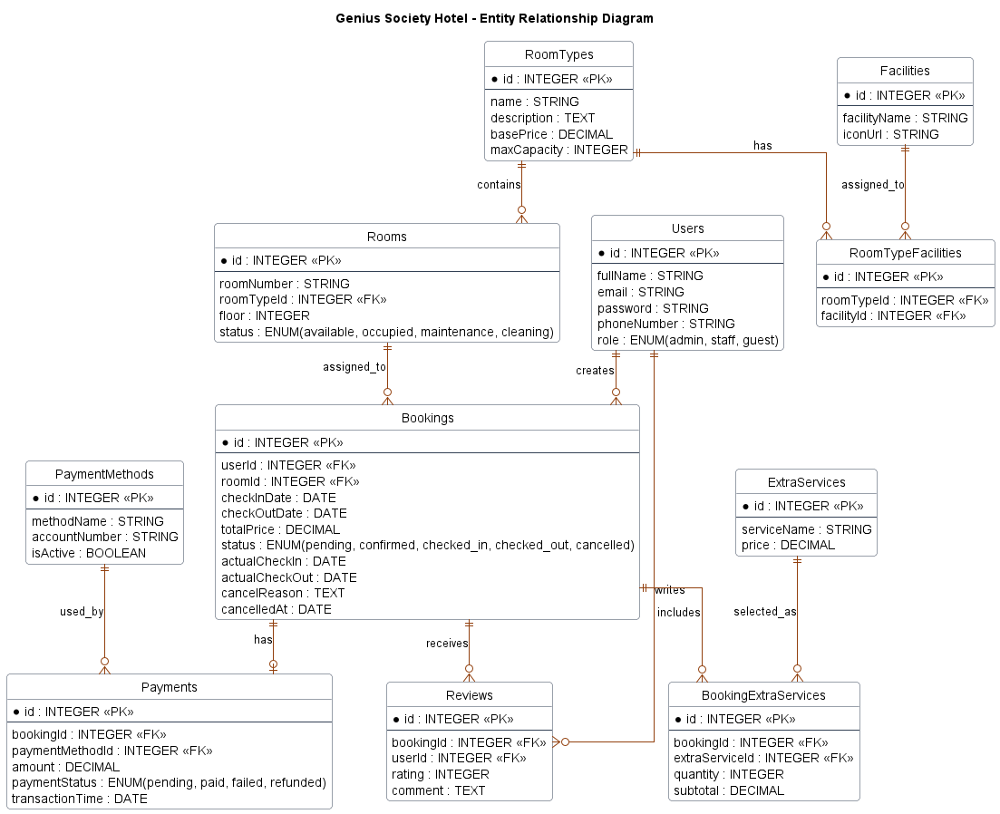

<div align="center">

  EN
</div>

<p align="center">
  
  
  
  
  
  
</p>

<p align="center" style="margin-top: -12px;">
  
  
  
</p>

<div align="center">

# ✨ Genius Society — Hotel Reservation System
### Modern, full-stack hotel booking platform with admin analytics and real-time availability
</div>

## 🚀 Why Genius Society

<div style="max-width: 720px;">

Genius Society is a modern hotel reservation system built for 5‑star properties. It pairs a polished, responsive React frontend with a robust Node/Express backend and PostgreSQL storage to deliver secure user flows, reliable booking orchestration, real-time operational updates, and actionable revenue analytics. The architecture handles real-world hotel needs like availability validation, payment flow coordination, admin operations, live dashboard updates, and production-ready modularity.</div>

<br>

- ⚡ End-to-end booking flows with real-time availability checks  
- 🔐 JWT authentication, bcrypt password hashing, and role-based admin protection  
- 📊 Built-in admin analytics and revenue reporting  
- 🔁 Socket.IO + PostgreSQL LISTEN/NOTIFY realtime update pipeline  
- 🎨 Luxury-themed responsive UI powered by Tailwind CSS  
- 🛠️ Modular controller/service/route architecture that is easy to extend  

## 🎯 Features

### A) Core Reservation Features

1. 👥 User Management — registration, authentication, profile management, and admin-managed users  
2. 🛏️ Room Browsing — view room types, descriptions, prices, capacities, and facilities  
3. 📅 Booking Flow — check availability, create, update, continue pending payment, and cancel reservations  
4. 💳 Payment Flow — confirm payments and keep booking totals aligned with selected extra services  
5. 🧾 Admin Dashboard — manage bookings, confirmations, check-ins, check-outs, and cancellations  
6. 🔁 Room Availability — live room availability tracking and room status management  
7. 💸 Revenue Analytics — revenue statistics, recent transactions, and room-type revenue breakdowns  
8. 🧰 Facilities & Extra Services — manage hotel facilities and paid add-on services  
9. ⭐ Reviews — guests can create, edit, and delete reviews  
10. 🎨 UI Theme — luxury amber-themed design with responsive layouts  
11. 📱 Responsive — mobile-friendly pages, admin navigation, forms, and room browsing  
12. 🔒 Secure Defaults — JWT sessions, protected admin routes, password hashing, and centralized error responses  

### B) Platform & System Capabilities

13. 🗄️ Relational Storage — PostgreSQL with Sequelize ORM  
14. ⚙️ Migrations & Seeders — reproducible schema and sample data setup  
15. 🔁 Realtime Updates — Socket.IO frontend listeners backed by PostgreSQL notification channels  
16. 🧑‍💼 Admin Presence — staff online state and active editing indicators  
17. 🧩 Modular Structure — clear separation of controllers, services, routes, hooks, components, and utilities  
18. 📦 Production Build — Vite frontend build and backend production start support  
19. 🧪 Quality Tooling — ESLint for both backend and frontend  
20. 📚 API Documentation — Swagger documentation support for backend routes  

## 🔴 Real-Time Implementation

The project includes real-time synchronization between guest-facing pages and admin dashboards.

### Live Use Cases

1. **My Bookings + Our Rooms Updates**  
   When an admin updates room availability or room status, the user-facing **Our Rooms** page updates immediately without needing a refresh.

2. **Payment → Revenue Dashboard**  
   When a user completes payment, the admin **Revenue Dashboard** refreshes immediately through realtime payment updates.

3. **Admin Guest Editing Presence**  
   When one admin edits a guest/user, other admins can see that the same guest is being edited in real time. This works as a soft-lock warning system, so admins are informed before causing conflicting edits.

4. **Booking Lifecycle Sync**  
   When admin confirms, checks in, checks out, or cancels a booking, the guest booking pages update in real time. When the guest performs self check-in, self check-out, or cancellation, the admin dashboard also updates in real time.

### Realtime Event Domains

- `booking:created`
- `booking:status_changed`
- `room:availability_changed`
- `room:status_changed`
- `payment:updated`
- `user:created`
- `user:updated`
- `user:deleted`
- `editing:started`
- `editing:stopped`
- `editing:active_list`
- `staff:online`
- `staff:offline`
- `staff:active_list`
- `audit:created`

### Realtime Architecture

```txt
Backend service action
→ event publisher
→ PostgreSQL LISTEN / NOTIFY channel
→ Socket.IO server
→ authenticated Socket.IO rooms
→ React WebSocketProvider
→ useWebSocket listeners
→ UI state updates
```

The backend separates realtime events into notification channels such as booking, payment, room, and user events. The frontend keeps one Socket.IO connection per authenticated session and registers event-specific listeners through the `useWebSocket` hook.

## 🧠 Architecture Highlights

- Split frontend (React + Tailwind) and backend (Node + Express) for clear responsibilities  
- PostgreSQL stores transactional booking, payment, room, review, and user data  
- Sequelize provides model definitions, relationships, migrations, and seeders  
- REST API follows controller → service → model separation  
- JWT authentication protects user and admin-only routes  
- Socket.IO handles live frontend updates  
- PostgreSQL LISTEN/NOTIFY allows realtime events to stay decoupled from REST controllers  
- Admin dashboards receive live booking, room, payment, user, and editing updates  
- Frontend uses reusable hooks and API endpoint service wrappers to keep pages clean  

## 💡 Design Considerations

- Bookings require strict availability checks to avoid double-booking  
- Pending bookings can retain selected extra services before payment completion  
- Payment processing uses the server-side booking total as the source of truth  
- Admin room management needs to show all room types, while public room browsing only shows available room types  
- User edits support optimistic conflict protection through `expectedUpdatedAt`  
- Admin editing presence is a soft-lock system: it warns other admins but does not hard-block edits  
- Environment variables are used for API URLs, secrets, and database configuration  
- Frontend and backend run independently during development for faster iteration  

## 🔧 Processing Models

### 🔄 Server-Side Booking Flow (Transactional)

1. User selects room type, dates, guest count, and optional extra services  
2. Frontend validates required fields and stay length  
3. Backend validates availability against bookings and physical room inventory  
4. Booking record is created or updated  
5. Extra services are persisted with the booking when selected  
6. Payment confirms the booking/payment lifecycle  
7. Realtime events update admin dashboards and guest pages  

### ⚡ Client-Side Interactions (Instant)

1. User navigates UI and previews room details  
2. Client performs lightweight validation and date selection updates  
3. Frontend API services call backend endpoints through a shared Axios client  
4. WebSocket listeners update relevant screens without manual refresh  
5. Admin and guest screens stay synchronized through shared realtime event contracts  

## 🏗️ Architecture & Stack

<div style="max-width: 760px; line-height: 1.65;">

- **Frontend (React 19 + Vite 8 + Tailwind CSS 4)** — UI, client routing, API integration, responsive pages, and WebSocket listeners.  
  <br />
  

- **Backend (Node.js + Express 5)** — REST API, authentication, business logic, Socket.IO server, Swagger docs, and migrations.  
  <br />
  

- **Database (PostgreSQL + Sequelize 6)** — persistent relational storage, migrations, seeders, and LISTEN/NOTIFY realtime event transport.  
  <br />
  

</div>

## 📦 Main Dependencies

### Frontend

- React `^19.2.5`
- React DOM `^19.2.5`
- React Router DOM `^7.14.0`
- Vite `^8.0.16`
- Tailwind CSS `^4.0.0`
- Axios `^1.15.0`
- Socket.IO Client `^4.8.3`
- React DatePicker `^7.6.0`
- Lucide React `^1.8.0`

### Backend

- Express `^5.2.1`
- Sequelize `^6.37.8`
- PostgreSQL driver `pg ^8.22.0`
- Socket.IO `^4.8.3`
- JSON Web Token `^9.0.3`
- bcryptjs `^3.0.3`
- dotenv `^17.4.1`
- Swagger JSDoc `^6.3.0`
- Swagger UI Express `^5.0.1`

## 📁 Project Structure

```txt
hotel-reservation-genius/
├── backend/
│   ├── config/
│   ├── controllers/
│   │   ├── auth/
│   │   ├── base/
│   │   ├── booking/
│   │   ├── payment/
│   │   ├── room/
│   │   └── users/
│   ├── docs/
│   ├── middleware/
│   ├── migrations/
│   ├── models/
│   ├── routes/
│   │   ├── auth/
│   │   ├── booking/
│   │   ├── payment/
│   │   ├── room/
│   │   └── users/
│   ├── seeders/
│   ├── services/
│   │   ├── auth/
│   │   ├── base/
│   │   ├── booking/
│   │   ├── payment/
│   │   ├── room/
│   │   ├── users/
│   │   └── websocket/
│   ├── shared/
│   ├── utils/
│   ├── app.js
│   └── server.js
│
├── frontend/
│   ├── public/
│   └── src/
│       ├── assets/
│       ├── components/
│       │   ├── admin/
│       │   ├── auth/
│       │   ├── booking/
│       │   ├── facilities/
│       │   ├── home/
│       │   ├── reviews/
│       │   ├── rooms/
│       │   └── ui/
│       ├── context/
│       ├── data/
│       ├── hooks/
│       │   ├── admin/
│       │   ├── auth/
│       │   ├── booking/
│       │   └── public/
│       ├── layouts/
│       ├── pages/
│       │   ├── admin/
│       │   ├── auth/
│       │   ├── booking/
│       │   └── public/
│       ├── services/
│       │   ├── api/
│       │   └── endpoints/
│       ├── shared/
│       ├── styles/
│       └── utils/
│
├── LICENSE
├── README.md
└── start_app.bat
```

## ⚙️ Environment Variables

### Backend (`backend/.env`)

```env
NODE_ENV=development
PORT=3000

DB_NAME=hotel_reservation_db
DB_USER=postgres
DB_PASSWORD=your_postgres_password
DB_HOST=127.0.0.1
DB_DIALECT=postgres

JWT_SECRET=your_jwt_secret

BASE_URL=http://localhost:3000
API_URL=http://localhost:3000/api
```

### Frontend (`frontend/.env`)

```env
BASE_URL=http://localhost:3000
VITE_API_URL=http://localhost:3000/api
VITE_DEBUG_MODE=true
```

```md
`VITE_API_URL` is used by the frontend Axios client and WebSocket provider.  
The WebSocket provider derives the Socket.IO server URL by removing `/api` from `VITE_API_URL`.

For production, do not use `localhost`. Use the deployed backend URL instead, you should also set the **VITE_DEBUG_MODE** to false


VITE_API_URL=https://your-backend-domain.com/api
VITE_DEBUG_MODE=false
```

## 🚀 Local Development

### 1. CLONE THE REPOSITORY

```bash
git clone https://github.com/Jensenix/hotel-reservation-genius.git
cd hotel-reservation-genius
```

### 2. PREPARE POSTGRESQL

Before running the backend, make sure PostgreSQL is installed and a database exists.

```sql
CREATE DATABASE hotel_reservation_db;
```

Then update `backend/.env` with your local database username and password.

### 3. RUN BACKEND

```bash
cd backend
npm install
npm run setup
npm run dev
```

The backend runs on:

```txt
http://localhost:3000
```

The API base URL is:

```txt
http://localhost:3000/api
```

Swagger API documentation is available at:

```txt
http://localhost:3000/api-docs
```

### 4. RUN FRONTEND

Open a second terminal:

```bash
cd frontend
npm install
npm run dev
```

The frontend usually runs on:

```txt
http://localhost:5173
```

### 5. RUN BOTH WITH BATCH FILE

You can also run both servers using the root batch file:

```bash
start_app.bat
```

The script automatically resolves the project root from its own file location, then starts the frontend and backend in separate terminals.

## 🧰 Useful Scripts

### Backend Scripts

```bash
npm run dev
```
Starts the backend with Nodemon.

```bash
npm run setup
```
Runs migrations and seeders.

```bash
npm run db:reset
```
Rolls back all migrations, runs migrations again, then runs all seeders.

```bash
npm start
```
Runs `db:reset` and then starts the backend with Node.

```bash
npm run lint
npm run lint:fix
```
Runs ESLint checks and auto-fixes where possible.

### Frontend Scripts

```bash
npm run dev
```
Starts the Vite development server.

```bash
npm run build
```
Builds the frontend for production.

```bash
npm run preview
```
Previews the production build.

```bash
npm run test
```
Runs Vitest.

```bash
npm run lint
npm run lint:fix
```
Runs ESLint checks and auto-fixes where possible.

## 🔒 Security Notes

- JWT authentication is used for protected routes  
- Admin-only routes use authentication and role authorization middleware  
- Passwords are hashed with bcryptjs  
- Axios automatically attaches the stored JWT token to API requests  
- Unauthorized API responses redirect users back to login  
- Backend errors are normalized through global error handling  
- Environment variables should be used for secrets and database credentials  
- Never commit real `.env` files or production secrets  

## 🗄️ Database Schema

### 📊 Entity Relationship Diagram (ERD)

<div align="center">
  
</div>

## 📚 API Endpoints

### Legend

- **Public** — no login required  
- **Auth** — JWT login required  
- **Admin** — JWT login required with admin role  

### 🔐 Authentication

| Method | Endpoint | Access | Description |
|---|---|---:|---|
| `POST` | `/api/auth/login` | Public | Login user |
| `POST` | `/api/auth/register` | Public | Register new user |

### 👥 Users

| Method | Endpoint | Access | Description |
|---|---|---:|---|
| `GET` | `/api/users` | Admin | Get all users |
| `POST` | `/api/users` | Admin | Create user |
| `GET` | `/api/users/:id` | Auth | Get user by ID |
| `PUT` | `/api/users/:id` | Auth | Update user |
| `DELETE` | `/api/users/:id` | Admin | Delete user |

### 🧍 Guests

| Method | Endpoint | Access | Description |
|---|---|---:|---|
| `GET` | `/api/guests` | Admin | Get guests with pagination and search |
| `GET` | `/api/guests/:id` | Admin | Get guest details by ID |

### 🏨 Rooms

| Method | Endpoint | Access | Description |
|---|---|---:|---|
| `GET` | `/api/rooms` | Public | Get all rooms |
| `GET` | `/api/rooms/with-room-type` | Public | Get all rooms with room type details |
| `GET` | `/api/rooms/:id` | Public | Get room by ID |
| `POST` | `/api/rooms` | Admin | Create room |
| `PUT` | `/api/rooms/:id/status` | Admin | Update room status |
| `PUT` | `/api/rooms/:id` | Admin | Update room |
| `DELETE` | `/api/rooms/:id` | Admin | Delete room |

### 🏷️ Room Types

| Method | Endpoint | Access | Description |
|---|---|---:|---|
| `GET` | `/api/room-types` | Public | Get availability-aware room type listing |
| `GET` | `/api/room-types/with-facilities` | Public | Get room types with facilities for management/display |
| `GET` | `/api/room-types/:id` | Public | Get room type by ID |
| `POST` | `/api/room-types` | Admin | Create room type |
| `PUT` | `/api/room-types/:id` | Admin | Update room type |
| `DELETE` | `/api/room-types/:id` | Admin | Delete room type |

### 🔁 Room Availability

| Method | Endpoint | Access | Description |
|---|---|---:|---|
| `GET` | `/api/room-availability` | Public | Get general room availability |
| `GET` | `/api/room-availability/stats` | Public | Get room availability statistics |
| `GET` | `/api/room-availability/room-type/:roomTypeId` | Public | Get availability by room type |

### 📋 Bookings

| Method | Endpoint | Access | Description |
|---|---|---:|---|
| `GET` | `/api/bookings/check-availability` | Public | Check room availability by date |
| `GET` | `/api/bookings/available-rooms` | Public | Get available rooms |
| `POST` | `/api/bookings` | Auth | Create booking |
| `GET` | `/api/bookings/user/:userId` | Auth | Get bookings by user |
| `GET` | `/api/bookings/:id` | Auth | Get booking by ID |
| `PUT` | `/api/bookings/:id` | Auth | Update booking |
| `PUT` | `/api/bookings/:id/cancel` | Auth | Cancel own booking |
| `PUT` | `/api/bookings/:id/self-check-in` | Auth | User self check-in |
| `PUT` | `/api/bookings/:id/self-check-out` | Auth | User self check-out |
| `GET` | `/api/bookings` | Admin | Get all bookings |
| `GET` | `/api/bookings/admin/all` | Admin | Get all bookings for admin dashboard |
| `PUT` | `/api/bookings/admin/:id/confirm` | Admin | Confirm booking |
| `PUT` | `/api/bookings/admin/:id/check-in` | Admin | Admin check-in guest |
| `PUT` | `/api/bookings/admin/:id/check-out` | Admin | Admin check-out guest |
| `PUT` | `/api/bookings/admin/:id/cancel` | Admin | Cancel booking as admin |
| `DELETE` | `/api/bookings/:id` | Admin | Delete booking |

### 🧾 Booking Extra Services

| Method | Endpoint | Access | Description |
|---|---|---:|---|
| `POST` | `/api/booking-extra-services` | Auth | Add extra service to booking |
| `GET` | `/api/booking-extra-services/booking/:bookingId` | Auth | Get extra services by booking ID |
| `DELETE` | `/api/booking-extra-services/:id` | Auth | Delete booking extra service |

### 🏢 Facilities

| Method | Endpoint | Access | Description |
|---|---|---:|---|
| `GET` | `/api/facilities` | Public | Get all facilities |
| `GET` | `/api/facilities/:id` | Public | Get facility by ID |
| `POST` | `/api/facilities` | Admin | Create facility |
| `PUT` | `/api/facilities/:id` | Admin | Update facility |
| `DELETE` | `/api/facilities/:id` | Admin | Delete facility |

### 🧰 Extra Services

| Method | Endpoint | Access | Description |
|---|---|---:|---|
| `GET` | `/api/extra-services` | Public | Get all extra services |
| `GET` | `/api/extra-services/:id` | Public | Get extra service by ID |
| `POST` | `/api/extra-services` | Admin | Create extra service |
| `PUT` | `/api/extra-services/:id` | Admin | Update extra service |
| `DELETE` | `/api/extra-services/:id` | Admin | Delete extra service |

### 💳 Payments

| Method | Endpoint | Access | Description |
|---|---|---:|---|
| `POST` | `/api/payments` | Auth | Create payment |
| `GET` | `/api/payments/:id` | Auth | Get payment by ID |
| `PUT` | `/api/payments/:id` | Auth | Update payment |
| `GET` | `/api/payments` | Admin | Get all payments |
| `DELETE` | `/api/payments/:id` | Admin | Delete payment |

### 🏦 Payment Methods

| Method | Endpoint | Access | Description |
|---|---|---:|---|
| `POST` | `/api/payment-methods` | Public | Create payment method |
| `GET` | `/api/payment-methods` | Public | Get all payment methods |
| `GET` | `/api/payment-methods/:id` | Public | Get payment method by ID |
| `PUT` | `/api/payment-methods/:id` | Public | Update payment method |
| `DELETE` | `/api/payment-methods/:id` | Public | Delete payment method |

### 💰 Revenue Analytics

| Method | Endpoint | Access | Description |
|---|---|---:|---|
| `GET` | `/api/revenue/stats` | Admin | Get revenue statistics |

### ⭐ Reviews

| Method | Endpoint | Access | Description |
|---|---|---:|---|
| `GET` | `/api/reviews` | Public | Retrieve all reviews |
| `POST` | `/api/reviews` | Auth | Create review |
| `GET` | `/api/reviews/user` | Auth | Get current user's reviews |
| `GET` | `/api/reviews/:id` | Public | Get review by ID |
| `PUT` | `/api/reviews/:id` | Auth | Update review |
| `DELETE` | `/api/reviews/:id` | Auth | Delete review |

## 🧪 Testing & Quality

This project uses ESLint for backend and frontend code quality checks.

```bash
cd backend
npm run lint
```

```bash
cd frontend
npm run lint
```

The frontend also includes Vitest support:

```bash
cd frontend
npm run test
```

## 🤝 Contributing

PRs and improvements are welcome. Suggested workflow:

1. Fork the repository
2. Create a feature branch (`git checkout -b feature/awesome`)
3. Commit your changes (`git commit -m 'Add awesome feature'`)
4. Push to your branch (`git push origin feature/awesome`)
5. Open a Pull Request and describe the change

If you plan a larger change, open an issue first to align on scope.

## 📜 License

Licensed under the MIT License. See [LICENSE](./LICENSE) for details.

## 🙏 Acknowledgements

- Sequelize project and migration tooling
- Express and React communities
- PostgreSQL and Socket.IO realtime ecosystem
- Open-source contributors and libraries used

## 👤 Contributors

Made with ❤️ by the Genius Society team:

<table>
  <tr>
    <td align="center" width="180">
      <a href="https://github.com/Dendroculus">
        <br>
        <b>Dendroculus</b><br>
        <sub><b>Documenter and Maintainer</b></sub>
      </a>
    </td>
    <td align="center" width="180">
      <a href="https://github.com/Jensenix">
        <br>
        <b>Jensenix</b><br>
        <sub><b>Backend Dev & Project Owner</b></sub>
      </a>
    </td>
    <td align="center" width="180">
      <a href="https://github.com/Serthonss">
        <br>
        <b>Serthonss</b><br>
        <sub><b>Frontend Dev and Tester</b></sub>
      </a>
    </td>
    <td align="center" width="180">
      <a href="https://github.com/vincentlawi">
        <br>
        <b>vincentlawi</b><br>
        <sub><b>UI/UX Designer</b></sub>
      </a>
    </td>
  </tr>
</table>